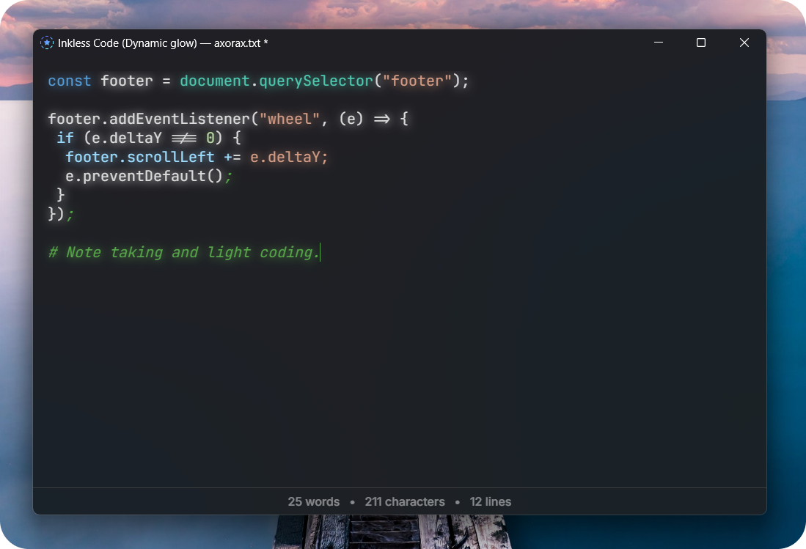

<p align="center">
    
</p>

<p align="center">
    <b>Inkless</b>
</p>

<p align="center">
    Write simple, stay focused.
</p>

## ❓ About

Inkless is a minimal, lightweight (less than 4 MB), shortcut-based text editor. You can use it for writing notes or coding.

<br>

<p align="center">
    
</p>

<br>

A `*` will appear in the titlebar for unsaved changes, and it will also indicate if code mode or dynamic glow is enabled. Anything you paste is automatically converted to plain text. You can go to the url `inkless://` to open the app.

Inkless also supports extensions. Settings and extensions are stored in a file called `data.inkless` (located in same directory as executable). Extensions are written in JavaScript and have full access to all web features. To add an extension, add this to the file:

```
ext.EXTENSION_NAME = ---
<CODE-HERE>
---
```

Example data file with settings and extensions:

```
theme = mica # mica | dark | light
code_mode = yes
glow = no

ext.greetuser = ---
alert("hello!");
---

ext.anotherone = ---
if (5 > 4) {
    alert("5 is greater than 4.");
}
---
```

Donations are really appreciated and would help in the improvement of the project! https://www.patreon.com/axorax

> [!NOTE]
> If the status bar (the bottom area that has word count, line count, etc.) overflows and you cannot see the rest of the content, then, you can scroll to go sideways.

## 🎹 Keyboard shortcuts

For macOS, use the meta key instead of `CTRL`.

| Shortcut           | Description                                                         |
| ------------------ | ------------------------------------------------------------------- |
| `CTRL + P`         | Open command palette                                                |
| `CTRL + O`         | Open document                                                       |
| `CTRL + S`         | Save document                                                       |
| `CTRL + .`         | Run Inkless action                                                  |
| `CTRL + M`         | Toggle Mica effect (Windows only)                                   |
| `CTRL + T`         | Switch between themes                                               |
| `CTRL + W`         | Toggle status bar visibility                                        |
| `CTRL + F`         | Find and search tool                                                |
| `CTRL + G`         | Toggle grid                                                         |
| `CTRL + E`         | Toggle spellchecker                                                 |
| `CTRL + SHIFT + P` | Open print menu                                                     |
| `CTRL + R`         | Reload app                                                          |
| `CTRL + N`         | Toggle glow                                                         |
| `CTRL + SHIFT + N` | Toggle dynamic glow (Takes more processing power, code mode only)   |
| `CTRL + SHIFT + R` | Rainbow mode (fun)                                                  |
| `CTRL + SHIFT + S` | Text to speech. Will speak selected text otherwise entire document. |
| `CTRL + Scroll`    | Increase or decrease font size                                      |
| `CTRL + SHIFT + C` | Toggle code mode                                                    |

# Inkless actions

Type an action, select it and press `CTRL + .` to execute the action.

| Command         | Description                                                   | Example Output                                   |
| --------------- | ------------------------------------------------------------- | ------------------------------------------------ |
| `i.date`        | Inserts the current date and time.                            | `2/26/2025, 2:45:30 PM`                          |
| `i.time`        | Inserts the current time.                                     | `2:45:30 PM`                                     |
| `i.year`        | Inserts the current year.                                     | `2025`                                           |
| `i.day`         | Inserts the name of the current day of the week.              | `Monday`                                         |
| `i.month`       | Inserts the current month.                                    | `February`                                       |
| `i.random`      | Inserts a random number between 0 and 100.                    | `57`                                             |
| `i.flip`        | Simulates a coin flip and inserts "Heads" or "Tails".         | `Heads`                                          |
| `i.timestamp`   | Inserts the current Unix timestamp (seconds since 1970).      | `1614346235`                                     |
| `i.iso`         | Inserts the current date and time in ISO 8601 format.         | `2025-02-26T14:45:30.000Z`                       |
| `i.pi`          | Inserts the value of π (Pi).                                  | `3.1415926535`                                   |
| `i.e`           | Inserts the value of e (Euler's number).                      | `2.7182818284`                                   |
| `i.password`    | Generates a random strong password.                           | `G!h72$h9kL`                                     |
| `i.hex`         | Generates a random hex color.                                 | `#f2a200`                                        |
| `i.magic8`      | Simulates a Magic 8-Ball response.                            | `Yes`                                            |
| `i.uuid`        | Generates a unique UUID.                                      | `e0cb3d9e-1c2d-4c9d-b1d2-349ae4812349`           |
| `i.systemInfo`  | Displays information about the system (User Agent, Platform). | `User Agent: Mozilla/5.0...`                     |
| `i.memoryUsage` | Displays current memory usage of the JavaScript heap.         | `Used JS Memory: 10 MB / Total JS Memory: 50 MB` |
| `2+2/4*3`       | Execute any math.                                             | 3.5                                              |

## ⌨️ Editor shortcuts

You can use these shortcuts while writing in the input field (CODE MODE ONLY). For macOS, use the meta key instead of `CTRL`.

| Shortcut                     | Description                                           |
| ---------------------------- | ----------------------------------------------------- |
| `"`, `'`, `(`, `{`, `[`, `<` | Automatically closes it and puts cursor in the middle |
| `Tab`                        | Indent with four spaces                               |
| `CTRL + X `                  | Copy and delete line                                  |
| `Home`                       | Go to start of line                                   |
| `End`                        | Go to end of line                                     |
| `Delete`                     | Remove character infront of cursor                    |

## 💻 Supported programming languages

| Language      | Language       | Language   | Language     | Language   | Language      | Language   |
| ------------- | -------------- | ---------- | ------------ | ---------- | ------------- | ---------- |
| 1c            | abnf           | accesslog  | actionscript | ada        | angelscript   | apache     |
| applescript   | arcade         | arduino    | armasm       | xml        | asciidoc      | aspectj    |
| autohotkey    | autoit         | avrasm     | awk          | axapta     | bash          | basic      |
| bnf           | brainfuck      | c          | cal          | capnproto  | ceylon        | clean      |
| clojure       | clojure-repl   | cmake      | coffeescript | coq        | cos           | cpp        |
| crmsh         | crystal        | csharp     | csp          | css        | d             | markdown   |
| dart          | delphi         | diff       | django       | dns        | dockerfile    | dos        |
| dsconfig      | dts            | dust       | ebnf         | elixir     | elm           | ruby       |
| erb           | erlang-repl    | erlang     | excel        | fix        | flix          | fortran    |
| fsharp        | gams           | gauss      | gcode        | gherkin    | glsl          | gml        |
| go            | golo           | gradle     | graphql      | groovy     | haml          | handlebars |
| haskell       | haxe           | hsp        | http         | hy         | inform7       | ini        |
| irpf90        | isbl           | java       | javascript   | jboss-cli  | json          | julia      |
| julia-repl    | kotlin         | lasso      | latex        | ldif       | leaf          | less       |
| lisp          | livecodeserver | livescript | llvm         | lsl        | lua           | makefile   |
| mathematica   | matlab         | maxima     | mel          | mercury    | mipsasm       | mizar      |
| perl          | mojolicious    | monkey     | moonscript   | n1ql       | nestedtext    | nginx      |
| nim           | nix            | node-repl  | nsis         | objectivec | ocaml         | openscad   |
| oxygene       | parser3        | pf         | pgsql        | php        | php-template  | plaintext  |
| pony          | powershell     | processing | profile      | prolog     | properties    | protobuf   |
| puppet        | purebasic      | python     | python-repl  | q          | qml           | r          |
| reasonml      | rib            | roboconf   | routeros     | rsl        | ruleslanguage | rust       |
| sas           | scala          | scheme     | scilab       | scss       | shell         | smali      |
| smalltalk     | sml            | sqf        | sql          | stan       | stata         | step21     |
| stylus        | subunit        | swift      | taggerscript | yaml       | tap           | tcl        |
| thrift        | tp             | twig       | typescript   | vala       | vbnet         | vbscript   |
| vbscript-html | verilog        | vhdl       | vim          | wasm       | wren          | x86asm     |
| xl            | xquery         | zephir     |              |            |               |            |

---

<p align="center">
    <a href="https://github.com/Axorax/socials">Socials + Donate</a>
</p>
